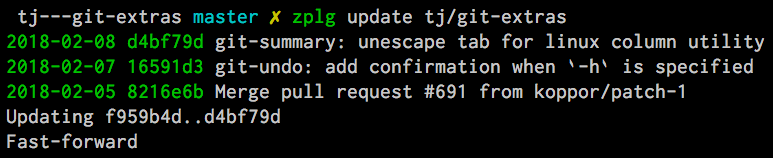

<p align="center">
  <a href="https://github.com/zdharma-continuum/zinit">
    
  </a>
</p>

# Zinit<a name="zinit"></a>

[![MIT License][mit-badge]][mit-link] [![zinit version][ver-badge]][ver-link] [![zunit tests][tests-badge]][tests-link]
[![Join the chat at https://gitter.im/zdharma-continuum/zinit][gitter-badge]][gitter-link]

<!-- mdformat-toc start --slug=github --maxlevel=3 --minlevel=2 -->

- [Zinit Wiki](#zinit-wiki)
- [Install](#install)
  - [Automatic](#automatic)
  - [Manual](#manual)
- [Usage](#usage)
  - [Introduction](#introduction)
  - [Plugins and snippets](#plugins-and-snippets)
  - [Upgrade Zinit and plugins](#upgrade-zinit-and-plugins)
  - [Turbo and lucid](#turbo-and-lucid)
  - [Migration](#migration)
- [Frequently Asked Questions](#frequently-asked-questions)
  - [Use `zi ice svn` if a plugin/snippet requires an entire subdirectory](#use-zi-ice-svn-if-a-pluginsnippet-requires-an-entire-subdirectory)
  - [Use `zi ice as'completion'` to directly add single file completion snippets](#use-zi-ice-ascompletion-to-directly-add-single-file-completion-snippets)
  - [More Examples](#more-examples)
- [Ice Modifiers](#ice-modifiers)
  - [Cloning Options](#cloning-options)
  - [Selection of Files (To Source, …)](#selection-of-files-to-source-%E2%80%A6)
  - [Conditional Loading](#conditional-loading)
  - [Plugin Output](#plugin-output)
  - [Completions](#completions)
  - [Command Execution After Cloning, Updating or Loading](#command-execution-after-cloning-updating-or-loading)
  - [Sticky-Emulation Of Other Shells](#sticky-emulation-of-other-shells)
  - [Others](#others)
  - [Order of Execution](#order-of-execution)
- [Zinit Commands](#zinit-commands)
  - [Help](#help)
  - [Loading and Unloading](#loading-and-unloading)
  - [Completions](#completions-1)
  - [Tracking of the Active Session](#tracking-of-the-active-session)
  - [Reports and Statistics](#reports-and-statistics)
  - [Compiling](#compiling)
  - [Other](#other)
- [Updating Zinit and Plugins](#updating-zinit-and-plugins)
- [Completions](#completions-2)
  - [Calling `compinit` Without Turbo Mode](#calling-compinit-without-turbo-mode)
  - [Calling `compinit` With Turbo Mode](#calling-compinit-with-turbo-mode)
  - [Ignoring Compdefs](#ignoring-compdefs)
  - [Disabling System-Wide `compinit` Call (Ubuntu)](#disabling-system-wide-compinit-call-ubuntu)
- [Zinit Module](#zinit-module)
- [Hints and Tips](#hints-and-tips)
  - [Using ZPFX variable](#using-zpfx-variable)
  - [Customizing Paths](#customizing-paths)
  - [Non-GitHub (Local) Plugins](#non-github-local-plugins)
  - [Extending Git](#extending-git)
- [Changelog](#changelog)
- [Support](#support)
- [Getting Help and Community](#getting-help-and-community)

<!-- mdformat-toc end -->

<p align="center">
<a href="https://github.com/zdharma-continuum/pm-perf-test">

</a>
</p>

Zinit is a flexible and fast Zshell plugin manager that will allow you to install everything from GitHub and other
sites. Its characteristics are:

1. Zinit is currently the only plugin manager that provides Turbo mode, which yields **50-80% faster Zsh startup**
   (i.e., the shell will start up to **5** times faster!). Check out a speed comparison with other popular plugin
   managers [here](https://github.com/zdharma-continuum/pm-perf-test).

2. The plugin manager gives **reports** from plugin loadings describing what **aliases**, functions, **bindkeys**, Zle
   widgets, zstyles, **completions**, variables, `PATH` and `FPATH` elements a plugin has set up. This allows one to
   quickly familiarize oneself with a new plugin and provides rich and easy-to-digest information which might be helpful
   on various occasions.

3. Supported is the unloading of plugin and ability to list, (un)install and **selectively disable**, **enable**
   plugin's completions.

4. The plugin manager supports loading plugins and libraries from Oh My Zsh or Prezto. However, the implementation isn't
   framework-specific and doesn't bloat the plugin manager with such code (more on this topic can be found on the Wiki,
   in the [Introduction](https://zdharma-continuum.github.io/zinit/wiki/INTRODUCTION/#oh_my_zsh_prezto)).

5. The system does not use `$FPATH`, loading multiple plugins doesn't clutter `$FPATH` with the same number of entries
   (e.g. `10`, `15` or more). Code is immune to `KSH_ARRAYS` and other options typically causing compatibility problems.

6. Zinit supports special, dedicated **packages** that offload the user from providing long and complex commands. See
   the [zinit-packages repository](https://github.com/zdharma-continuum/zinit-packages) for a growing, complete list of
   Zinit packages and the [Wiki page](https://zdharma-continuum.github.io/zinit/wiki/Zinit-Packages/) for an article
   about the feature.

7. Also, specialized Zinit extensions — called **annexes** — have the ability to extend the plugin manager with new
   commands, URL-preprocessors (used by e.g.:
   [zinit-annex-readurl](https://github.com/zdharma-continuum/zinit-annex-readurl) annex), post-install and post-update
   hooks, and much more. See the [zdharma-continuum](https://github.com/zdharma-continuum) organization for a growing,
   complete list of available Zinit extensions and refer to the
   [Wiki article](https://zdharma-continuum.github.io/zinit/wiki/Annexes/) for an introduction on creating your annex.

## Zinit Wiki<a name="zinit-wiki"></a>

The information in this README is complemented by the [Zinit Wiki](https://zdharma-continuum.github.io/zinit/wiki/). The
README is an introductory overview of Zinit, while the Wiki gives complete information with examples. Make sure to read
it to get the most out of Zinit.

## Install<a name="install"></a>

### Automatic<a name="automatic"></a>

The easiest way to install Zinit is to execute:

```bash
bash -c "$(curl --fail --show-error --silent --location https://raw.githubusercontent.com/zdharma-continuum/zinit/HEAD/scripts/install.sh)"
```

This will install Zinit in `~/.local/share/zinit/zinit.git`. `.zshrc` will be updated with three lines of code that will
be added to the bottom. The lines will be sourcing `zinit.zsh` and setting up completion for command `zinit`.

After installing and reloading the shell, compile Zinit via:

```zsh
zinit self-update
```

### Manual<a name="manual"></a>

In your `.zshrc`, add the following snippet

```zsh
ZINIT_HOME="${XDG_DATA_HOME:-${HOME}/.local/share}/zinit/zinit.git"
[ ! -d $ZINIT_HOME ] && mkdir -p "$(dirname $ZINIT_HOME)"
[ ! -d $ZINIT_HOME/.git ] && git clone https://github.com/zdharma-continuum/zinit.git "$ZINIT_HOME"
source "${ZINIT_HOME}/zinit.zsh"
```

[compinit](http://zsh.sourceforge.net/Doc/Release/Completion-System.html#Initialization)):

If you source `zinit.zsh` after `compinit`, add the following snippet after sourcing `zinit.zsh`:

```zsh
autoload -Uz _zinit
(( ${+_comps} )) && _comps[zinit]=_zinit
```

Reload Zsh to install Zinit:

```zsh
exec zsh
```

Various paths can be customized; see section [Customizing Paths](#customizing-paths).

## Usage<a name="usage"></a>

### Introduction<a name="introduction"></a>

[Click here to read the introduction to Zinit](https://zdharma-continuum.github.io/zinit/wiki/INTRODUCTION/). It
explains basic usage and some of the more unique features of Zinit, such as the Turbo mode. If you're new to Zinit, we
recommend you read it at least once.

### Plugins and snippets<a name="plugins-and-snippets"></a>

Plugins can be loaded using `load` or `light`.

```zsh
zinit load  <repo/plugin> # Load with reporting/investigating.
zinit light <repo/plugin> # Load without reporting/investigating.
```

If you want to source local or remote files (using direct URL), you can do so with `snippet`.

```zsh
zinit snippet <URL>
```

Such lines should be added to `.zshrc`. Snippets are cached locally. Use the `-f` option to download a new version of a
snippet or `zinit update {URL}`. You can also use `zinit update --all` to update all snippets (and plugins).

**Example**

```zsh
# Plugin history-search-multi-word loaded with investigating.
zinit load zdharma-continuum/history-search-multi-word

# Two regular plugins loaded without investigating.
zinit light zsh-users/zsh-autosuggestions
zinit light zdharma-continuum/fast-syntax-highlighting

# Snippet
zinit snippet https://gist.githubusercontent.com/hightemp/5071909/raw/
```

**Prompt(Theme) Example**

This is [powerlevel10k](https://github.com/romkatv/powerlevel10k), [pure](https://github.com/sindresorhus/pure),
[starship](https://github.com/starship/starship) sample:

```zsh
# Load powerlevel10k theme
zinit ice depth"1" # git clone depth
zinit light romkatv/powerlevel10k

# Load pure theme
zinit ice pick"async.zsh" src"pure.zsh" # with zsh-async library that's bundled with it.
zinit light sindresorhus/pure

# Load starship theme
# line 1: `starship` binary as command, from github release
# line 2: starship setup at clone(create init.zsh, completion)
# line 3: pull behavior same as clone, source init.zsh
zinit ice as"command" from"gh-r" \
          atclone"./starship init zsh > init.zsh; ./starship completions zsh > _starship" \
          atpull"%atclone" src"init.zsh"
zinit light starship/starship
```

### Upgrade Zinit and plugins<a name="upgrade-zinit-and-plugins"></a>

Zinit can be updated to `self-update` and plugins to `update`.

```zsh
# Self update
zinit self-update

# Plugin update
zinit update

# Plugin parallel update
zinit update --parallel

# Increase the number of jobs in a concurrent-set to 40
zinit update --parallel 40
```

### Turbo and lucid<a name="turbo-and-lucid"></a>

Turbo and lucid are the most used options.

<details>
  <summary><b>Turbo Mode</b></summary>
Turbo mode is the key to performance. It can be loaded asynchronously, which makes a huge difference when the amount of plugins increases.

Usually used as `zinit ice wait"<SECONDS>"`, let's use the previous example:

```zsh
zinit ice wait    # wait is the same as wait"0"
zinit load zdharma-continuum/history-search-multi-word

zinit ice wait"2" # load after 2 seconds
zinit load zdharma-continuum/history-search-multi-word

zinit ice wait    # also be used in `light` and `snippet`
zinit snippet https://gist.githubusercontent.com/hightemp/5071909/raw/
```

</details>

<details>
  <summary><b>Lucid</b></summary>

Turbo mode is verbose, so you need an option for quiet.

You can use `lucid`:

```zsh
zinit ice wait lucid
zinit load zdharma-continuum/history-search-multi-word
```

</details>

**_F&A:_** What is `ice`?

`ice` is zinit's options command. The option melts like ice and is used only once. (more:
[Ice Modifiers](#ice-modifiers))

### Migration<a name="migration"></a>

<details>
  <summary><b>Migration from Oh-My-ZSH</b></summary>

**Basic**

```zsh
zinit snippet <URL>        # Raw Syntax with URL
zinit snippet OMZ::<PATH>  # Shorthand OMZ/ (https://github.com/ohmyzsh/ohmyzsh/raw/master/)
zinit snippet OMZL::<PATH> # Shorthand OMZ/lib/
zinit snippet OMZT::<PATH> # Shorthand OMZ/themes/
zinit snippet OMZP::<PATH> # Shorthand OMZ/plugins/
```

**Library**

Importing the [clipboard](https://github.com/ohmyzsh/ohmyzsh/blob/master/lib/clipboard.zsh) and
[termsupport](https://github.com/ohmyzsh/ohmyzsh/blob/master/lib/termsupport.zsh) Oh-My-Zsh Library Sample:

```zsh
# Raw Syntax
zi snippet https://github.com/ohmyzsh/ohmyzsh/blob/master/lib/clipboard.zsh
zi snippet https://github.com/ohmyzsh/ohmyzsh/blob/master/lib/termsupport.zsh

# OMZ Shorthand Syntax
zi snippet OMZ::lib/clipboard.zsh
zi snippet OMZ::lib/termsupport.zsh

# OMZL Shorthand Syntax
zi snippet OMZL::clipboard.zsh
zi snippet OMZL::termsupport.zsh
```

**Theme**

To use **themes** created for Oh My Zsh you might want to first source the `git` library there.

Then you can use the themes as snippets (`zinit snippet <file path or GitHub URL>`). Some themes require not only Oh My
Zsh's Git **library**, but also Git **plugin** (error about `current_branch` may appear). Load this Git-plugin as
single-file snippet directly from OMZ.

Most themes require `promptsubst` option (`setopt promptsubst` in `zshrc`), if it isn't set, then prompt will appear as
something like: `... $(build_prompt) ...`.

You might want to suppress completions provided by the git plugin by issuing `zinit cdclear -q` (`-q` is for quiet) –
see below **Ignoring Compdefs**.

To summarize:

```zsh
## Oh My Zsh Setting
ZSH_THEME="robbyrussell"

## Zinit Setting
# Must Load OMZ Git library
zi snippet OMZL::git.zsh

# Load Git plugin from OMZ
zi snippet OMZP::git
zi cdclear -q # <- forget completions provided up to this moment

setopt promptsubst

# Load Prompt
zi snippet OMZT::robbyrussell
```

External Theme Sample: [NicoSantangelo/Alpharized](https://github.com/nicosantangelo/Alpharized)

```zsh
## Oh My Zsh Setting
ZSH_THEME="alpharized"

## Zinit Setting
# Must Load OMZ Git library
zi snippet OMZL::git.zsh

# Load Git plugin from OMZ
zi snippet OMZP::git
zi cdclear -q # <- forget completions provided up to this moment

setopt promptsubst

# Load Prompt
zi light NicoSantangelo/Alpharized
```

## Frequently Asked Questions<a name="frequently-asked-questions"></a>

Error occurs when loading OMZ's theme.

If the `git` library will not be loaded, the following errors will appear:

```zsh
........:1: command not found: git_prompt_status
........:1: command not found: git_prompt_short_sha
```

**Plugin**

If it consists of a single file, you can just load it.

```zsh
## Oh-My-Zsh Setting
plugins=(
  git
  dotenv
  rake
  rbenv
  ruby
)

## Zinit Setting
zi snippet OMZP::git
zi snippet OMZP::dotenv
zi snippet OMZP::rake
zi snippet OMZP::rbenv
zi snippet OMZP::ruby
```

### Use `zi ice svn` if a plugin/snippet requires an entire subdirectory<a name="use-zi-ice-svn-if-a-pluginsnippet-requires-an-entire-subdirectory"></a>

1. [gitfast](https://github.com/ohmyzsh/ohmyzsh/tree/master/plugins/gitfast)
2. [osx](https://github.com/ohmyzsh/ohmyzsh/tree/master/plugins/osx)

```zsh
zi ice svn
zi snippet OMZP::gitfast

zi ice svn
zi snippet OMZP::osx
```

### Use `zi ice as'completion'` to directly add single file completion snippets<a name="use-zi-ice-ascompletion-to-directly-add-single-file-completion-snippets"></a>

1. [docker](https://github.com/ohmyzsh/ohmyzsh/tree/master/plugins/docker)
2. [fd](https://github.com/ohmyzsh/ohmyzsh/tree/master/plugins/fd)

```zsh
zi ice as"completion"
zi snippet OMZP::docker/_docker

zi ice as"completion"
zi snippet OMZP::fd/_fd
```

[Find more information on Oh-My-Zsh + Zinit on the Wiki](https://zdharma-continuum.github.io/zinit/wiki/Example-Oh-My-Zsh-setup/)

</details>

<details>
  <summary><b>Migration from Prezto</b></summary>

**Basic**

```zsh
zi snippet <URL>        # Raw Syntax with URL
zi snippet PZT::<PATH>  # Shorthand PZT/ (https://github.com/sorin-ionescu/prezto/tree/master/)
zi snippet PZTM::<PATH> # Shorthand PZT/modules/
```

**Modules**

Importing the [environment](https://github.com/sorin-ionescu/prezto/tree/master/modules/environment) and
[terminal](https://github.com/sorin-ionescu/prezto/tree/master/modules/terminal) Prezto Modules Sample:

```zsh
## Prezto Setting
zstyle ':prezto:load' pmodule 'environment' 'terminal'

## Zinit Setting
# Raw Syntax
zi snippet https://github.com/sorin-ionescu/prezto/blob/master/modules/environment/init.zsh
zi snippet https://github.com/sorin-ionescu/prezto/blob/master/modules/terminal/init.zsh

# PZT Shorthand Syntax
zi snippet PZT::modules/environment
zi snippet PZT::modules/terminal

# PZTM Shorthand Syntax
zi snippet PZTM::environment
zi snippet PZTM::terminal
```

Use `zinit ice svn` if multiple files require an entire subdirectory. Like
[docker](https://github.com/sorin-ionescu/prezto/tree/master/modules/docker),
[git](https://github.com/sorin-ionescu/prezto/tree/master/modules/git):

```zsh
zi ice svn
zi snippet PZTM::docker

zi ice svn
zi snippet PZTM::git
```

Use `zinit ice as"null"` if don't exist `*.plugin.zsh`, `init.zsh`, `*.zsh-theme*` files in module. Like
[archive](https://github.com/sorin-ionescu/prezto/tree/master/modules/archive):

```zsh
zi ice svn as"null"
zi snippet PZTM::archive
```

Use `zinit ice atclone"git clone <repo> <location>"` if module have external module. Like
[completion](https://github.com/sorin-ionescu/prezto/tree/master/modules/completion):

```zsh
zi ice \
  atclone"git clone --recursive https://github.com/zsh-users/zsh-completions.git external" \
  blockf \ # use blockf to prevent any unnecessary additions to fpath, as zinit manages fpath
  svn

zi snippet PZTM::completion
```

**_F&A:_** What is `zstyle`?

Read [zstyle](http://zsh.sourceforge.net/Doc/Release/Zsh-Modules.html#The-zsh_002fzutil-Module) doc (more:
[What does `zstyle` do?](https://unix.stackexchange.com/questions/214657/what-does-zstyle-do)).

</details>

<details>
  <summary><b>Migration from Zgen</b></summary>

**Oh My Zsh**

More reference: check **Migration from Oh-My-ZSH**

```zsh
# Load ohmyzsh base
zgen oh-my-zsh
zi snippet OMZL::<ALL OF THEM>

# Load ohmyzsh plugins
zgen oh-my-zsh <PATH>
zi snippet OMZ::<PATH>
```

**Prezto**

More reference: check **Migration from Prezto**

```zsh
# Load Prezto
zgen prezto
zi snippet PZTM::<COMMENT's List> # environment terminal editor history directory spectrum utility completion prompt

# Load prezto plugins
zgen prezto <modulename>
zi snippet PZTM::<modulename>

# Load a repo as Prezto plugins
zgen pmodule <reponame> <branch>
zi ice ver"<branch>"
zi load <repo/plugin>

# Set prezto options
zgen prezto <modulename> <option> <value(s)>
zstyle ':prezto:<modulename>:' <option> <values(s)> # Set original prezto style
```

**General**

`location`: refer [Selection of Files](#selection-of-files-to-source-)

```zsh
zgen load <repo> [location] [branch]

zi ice ver"[branch]"
zi load <repo>
```

</details>

<details>
  <summary><b>Migration from Zplug</b></summary>

**Basic**

```zsh
zplug <repo/plugin>, tag1:<option1>, tag2:<option2>

zi ice tag1"<option1>" tag2"<option2>"
zi load <repo/plugin>
```

**Tag comparison**

- `as` => `as`
- `use` => `pick`, `src`, `multisrc`
- `ignore` => None
- `from` => `from`
- `at` => `ver`
- `rename-to` => `mv`, `cp`
- `dir` => Selection(`pick`, ...) with rename
- `if` => `if`
- `hook-build` => `atclone`, `atpull`
- `hook-load` => `atload`
- `frozen` => None
- `on` => None
- `defer` => `wait`
- `lazy` => `autoload`
- `depth` => `depth`

</details>

### More Examples<a name="more-examples"></a>

After installing Zinit you can start adding some actions (load some plugins) to `~/.zshrc`, at bottom. Some examples:

```zsh
# Load the pure theme, with zsh-async library that's bundled with it.
zi ice pick"async.zsh" src"pure.zsh"
zi light sindresorhus/pure

# A glance at the new for-syntax – load all of the above
# plugins with a single command. For more information see:
# https://zdharma-continuum.github.io/zinit/wiki/For-Syntax/
zinit for \
    light-mode \
  zsh-users/zsh-autosuggestions \
    light-mode \
  zdharma-continuum/fast-syntax-highlighting \
  zdharma-continuum/history-search-multi-word \
    light-mode \
    pick"async.zsh" \
    src"pure.zsh" \
  sindresorhus/pure

# Binary release in archive, from GitHub-releases page.
# After automatic unpacking it provides program "fzf".
zi ice from"gh-r" as"program"
zi light junegunn/fzf

# One other binary release, it needs renaming from `docker-compose-Linux-x86_64`.
# This is done by ice-mod `mv'{from} -> {to}'. There are multiple packages per
# single version, for OS X, Linux and Windows – so ice-mod `bpick' is used to
# select Linux package – in this case this is actually not needed, Zinit will
# grep operating system name and architecture automatically when there's no `bpick'.
zi ice from"gh-r" as"program" mv"docker* -> docker-compose" bpick"*linux*"
zi load docker/compose

# Vim repository on GitHub – a typical source code that needs compilation – Zinit
# can manage it for you if you like, run `./configure` and other `make`, etc.
# Ice-mod `pick` selects a binary program to add to $PATH. You could also install the
# package under the path $ZPFX, see: https://zdharma-continuum.github.io/zinit/wiki/Compiling-programs
zi ice \
  as"program" \
  atclone"rm -f src/auto/config.cache; ./configure" \
  atpull"%atclone" \
  make \
  pick"src/vim"
zi light vim/vim

# Scripts built at install (there's single default make target, "install",
# and it constructs scripts by `cat'ing a few files). The make'' ice could also be:
# `make"install PREFIX=$ZPFX"`, if "install" wouldn't be the only default target.
zi ice as"program" pick"$ZPFX/bin/git-*" make"PREFIX=$ZPFX"
zi light tj/git-extras

# Handle completions without loading any plugin; see "completions" command.
# This one is to be ran just once, in interactive session.
zi creinstall %HOME/my_completions
```

```zsh
# For GNU ls (the binaries can be gls, gdircolors, e.g. on OS X when installing the
# coreutils package from Homebrew; you can also use https://github.com/ogham/exa)
zi ice atclone"dircolors -b LS_COLORS > c.zsh" atpull'%atclone' pick"c.zsh" nocompile'!'
zi light trapd00r/LS_COLORS
```

[You can see an extended explanation of LS_COLORS in the Wiki.](https://zdharma-continuum.github.io/zinit/wiki/LS_COLORS-explanation/)

```zsh
# make'!...' -> run make before atclone & atpull
zi ice as"program" make'!' atclone'./direnv hook zsh > zhook.zsh' atpull'%atclone' src"zhook.zsh"
zi light direnv/direnv
```

[You can see an extended explanation of direnv in the Wiki.](https://zdharma-continuum.github.io/zinit/wiki/Direnv-explanation/)

If you're interested in more examples, then check out the
[zinit-configs repository](https://github.com/zdharma-continuum/zinit-configs), where users have uploaded their
`~/.zshrc` and Zinit configurations. Feel free to
[submit](https://github.com/zdharma-continuum/zinit-configs/issues/new?template=request-to-add-zshrc-to-the-zinit-configs-repo.md)
your `~/.zshrc` there if it contains Zinit commands.

You can also check out the [Gallery of Zinit Invocations](https://zdharma-continuum.github.io/zinit/wiki/GALLERY/) for
some additional examples.

Also, two articles on the Wiki present an example setup
[here](https://zdharma-continuum.github.io/zinit/wiki/Example-Minimal-Setup/) and
[here](https://zdharma-continuum.github.io/zinit/wiki/Example-Oh-My-Zsh-setup/).

# How to Use<a name="how-to-use"></a>

## Ice Modifiers<a name="ice-modifiers"></a>

Following `ice` modifiers are to be [passed](https://zdharma-continuum.github.io/zinit/wiki/Alternate-Ice-Syntax/) to
`zinit ice ...` to obtain described effects. The word `ice` means something that's added (like ice to a drink) – and in
Zinit it means adding modifier to a next `zinit` command, and also something that's temporary because it melts – and
this means that the modification will last only for a **single** next `zinit` command.

Some Ice-modifiers are highlighted and clicking on them will take you to the appropriate Wiki page for an extended
explanation.

You may safely assume a given ice works with both plugins and snippets unless explicitly stated otherwise.

### Cloning Options<a name="cloning-options"></a>

| Modifier    | Description                                                                                                                                                                                                                                                                                                                                  |
| :---------- | -------------------------------------------------------------------------------------------------------------------------------------------------------------------------------------------------------------------------------------------------------------------------------------------------------------------------------------------- |
| `bpick`     | Used to select which release from GitHub Releases to download, e.g. `zini ice from"gh-r" as"program" bpick"*Darwin*"; zini load docker/compose`. **Does not work with snippets.**                                                                                                                                                            |
| `cloneopts` | Pass the contents of `cloneopts` to `git clone`. Defaults to `--recursive`. I.e.: change cloning options. Pass empty ice to disable recursive cloning. **Does not work with snippets.**                                                                                                                                                      |
| `depth`     | Pass `--depth` to `git`, i.e. limit how much of history to download. **Does not work with snippets.**                                                                                                                                                                                                                                        |
| `from`      | Clone plugin from given site. Supported are `from"github"` (default), `..."github-rel"`, `..."gitlab"`, `..."bitbucket"`, `..."notabug"` (short names: `gh`, `gh-r`, `gl`, `bb`, `nb`). Can also be a full domain name (e.g. for GitHub enterprise). **Does not work with snippets.**                                                        |
| `proto`     | Change protocol to `git`,`ftp`,`ftps`,`ssh`, `rsync`, etc. Default is `https`. **Does not work with snippets.**                                                                                                                                                                                                                              |
| `pullopts`  | Pass the contents of `pullopts` to `git pull` used when updating plugins. **Does not work with snippets.**                                                                                                                                                                                                                                   |
| `svn`       | Use Subversion for downloading snippet. GitHub supports `SVN` protocol, this allows to clone subdirectories as snippets, e.g. `zinit ice svn; zinit snippet OMZP::git`. Other ice `pick` can be used to select file to source (default are: `*.plugin.zsh`, `init.zsh`, `*.zsh-theme`). **Does not work with plugins.**                      |
| `ver`       | Used with `from"gh-r"` (i.e. downloading a binary release, e.g. for use with `as"program"`) – selects which version to download. Default is latest, can also be explicitly `ver"latest"`. Works also with regular plugins and packages (`pack` ice) checkouts e.g. `ver"abranch"`, i.e. a specific version. **Does not work with snippets.** |

### Selection of Files (To Source, …)<a name="selection-of-files-to-source-%E2%80%A6"></a>

| Modifier   | Description                                                                                                                                                                                                                                |
| :--------- | ------------------------------------------------------------------------------------------------------------------------------------------------------------------------------------------------------------------------------------------ |
| `multisrc` | Allows to specify multiple files for sourcing, enumerated with spaces as the separators (e.g. `multisrc'misc.zsh grep.zsh'`) and also using brace-expansion syntax (e.g. `multisrc'{misc,grep}.zsh'`). Supports patterns.                  |
| `pick`     | Select the file to source, or the file to set as command (when using `snippet --command` or the ice `as"program"`); it is a pattern, alphabetically first matched file is being chosen; e.g. `zinit ice pick"*.plugin.zsh"; zinit load …`. |
| `src`      | Specify additional file to source after sourcing main file or after setting up command (via `as"program"`). It is not a pattern but a plain file name.                                                                                     |

### Conditional Loading<a name="conditional-loading"></a>

| Modifier                     | Description                                                                                                                                                                                                                                                                                                                                                              |
| :--------------------------- | ------------------------------------------------------------------------------------------------------------------------------------------------------------------------------------------------------------------------------------------------------------------------------------------------------------------------------------------------------------------------ |
| `cloneonly`                  | Don't load the plugin / snippet, only download it                                                                                                                                                                                                                                                                                                                        |
| `has`                        | Load plugin or snippet only when given command is available (in $PATH), e.g. `zinit ice has'git' ...`                                                                                                                                                                                                                                                                    |
| `if`                         | Load plugin or snippet only when given condition is fulfilled, for example: `zinit ice if'[[ -n "$commands[otool]" ]]'; zinit load ...`.                                                                                                                                                                                                                                 |
| `load`                       | A condition to check which should cause plugin to load. It will load once, the condition can be still true, but will not trigger second load (unless plugin is unloaded earlier, see `unload` below). E.g.: `load'[[ $PWD = */github* ]]'`.                                                                                                                              |
| `subscribe` / `on-update-of` | Postpone loading of a plugin or snippet until the given file(s) get updated, e.g. `subscribe'{~/files-*,/tmp/files-*}'`                                                                                                                                                                                                                                                  |
| `trigger-load`               | Creates a function that loads the associated plugin/snippet, with an option (to use it, precede the ice content with `!`) to automatically forward the call afterwards, to a command of the same name as the function. Can obtain multiple functions to create – sparate with `;`.                                                                                       |
| `unload`                     | A condition to check causing plugin to unload. It will unload once, then only if loaded again. E.g.: `unload'[[ $PWD != */github* ]]'`.                                                                                                                                                                                                                                  |
| `wait`                       | Postpone loading a plugin or snippet. For `wait'1'`, loading is done `1` second after prompt. For `wait'[[ ... ]]'`, `wait'(( ... ))'`, loading is done when given condition is meet. For `wait'!...'`, prompt is reset after load. Zsh can start 80% (i.e.: 5x) faster thanks to postponed loading. **Fact:** when `wait` is used without value, it works as `wait'0'`. |

### Plugin Output<a name="plugin-output"></a>

| Modifier | Description                                                                                                                                                                                                                                                                                                 |
| :------- | ----------------------------------------------------------------------------------------------------------------------------------------------------------------------------------------------------------------------------------------------------------------------------------------------------------- |
| `lucid`  | Skip `Loaded ...` message under prompt for `wait`, etc. loaded plugins (a subset of `silent`).                                                                                                                                                                                                              |
| `notify` | Output given message under-prompt after successfully loading a plugin/snippet. In case of problems with the loading, output a warning message and the return code. If starts with `!` it will then always output the given message. Hint: if the message is empty, then it will just notify about problems. |
| `silent` | Mute plugin's or snippet's `stderr` & `stdout`. Also skip `Loaded ...` message under prompt for `wait`, etc. loaded plugins, and completion-installation messages.                                                                                                                                          |

### Completions<a name="completions"></a>

| Modifier        | Description                                                                                                                                                                         |
| :-------------- | ----------------------------------------------------------------------------------------------------------------------------------------------------------------------------------- |
| `blockf`        | Disallow plugin to modify `fpath`. Useful when a plugin wants to provide completions in traditional way. Zinit can manage completions and plugin can be blocked from exposing them. |
| `completions`   | Do detect, install and manage completions for this plugin. Overwrites `as'null'` or `nocompletions`.                                                                                |
| `nocompletions` | Don't detect, install and manage completions for this plugin. Completions can be installed later with `zinit creinstall {plugin-spec}`.                                             |

### Command Execution After Cloning, Updating or Loading<a name="command-execution-after-cloning-updating-or-loading"></a>

| Modifier     | Description                                                                                                                                                                                                                                                                                                                                                                                                                                                                                                                                                                                                                                                               |
| :----------- | ------------------------------------------------------------------------------------------------------------------------------------------------------------------------------------------------------------------------------------------------------------------------------------------------------------------------------------------------------------------------------------------------------------------------------------------------------------------------------------------------------------------------------------------------------------------------------------------------------------------------------------------------------------------------- |
| `atclone`    | Run command after cloning, within plugin's directory, e.g. `zinit ice atclone"echo Cloned"`. Ran also after downloading snippet.                                                                                                                                                                                                                                                                                                                                                                                                                                                                                                                                          |
| `atinit`     | Run command after directory setup (cloning, checking it, etc.) of plugin/snippet but before loading.                                                                                                                                                                                                                                                                                                                                                                                                                                                                                                                                                                      |
| `atload`     | Run command after loading, within plugin's directory. Can be also used with snippets. Passed code can be preceded with `!`, it will then be investigated (if using `load`, not `light`).                                                                                                                                                                                                                                                                                                                                                                                                                                                                                  |
| `atpull`     | Run command after updating (**only if new commits are waiting for download**), within plugin's directory. If starts with "!" then command will be ran before `mv` & `cp` ices and before `git pull` or `svn update`. Otherwise it is ran after them. Can be `atpull'%atclone'`, to repeat `atclone` Ice-mod.                                                                                                                                                                                                                                                                                                                                                              |
| `configure`  | Runs `./configure` script and by default changes the installation directory by passing `--prefix=$ZPFX` to the script. Runs before `make''` and after `make'!'`, you can pass `'!'` too to this ice (i.e.: `configure'!'`) to make it execute earlier – before `make'!'` and after `make'!!'`. If `#` given in the ice value then also executes script `./autogen.sh` first before running `./configure`. The script is run anyway if there is no `configure` script. Also, when there exist another build-system related files, then it is run if no `configure` script is found. Currently supported systems are: CMake, scons and meson, checked-for/run in this order |
| `countdown`  | Causes an interruptable (by Ctrl-C) countdown 5…4…3…2…1…0 to be displayed before executing `atclone''`,`atpull''` and `make` ices                                                                                                                                                                                                                                                                                                                                                                                                                                                                                                                                         |
| `cp`         | Copy file after cloning or after update (then, only if new commits were downloaded). Example: `cp "docker-c* -> dcompose"`. Ran after `mv`.                                                                                                                                                                                                                                                                                                                                                                                                                                                                                                                               |
| `make`       | Run `make` command after cloning/updating and executing `mv`, `cp`, `atpull`, `atclone` Ice mods. Can obtain argument, e.g. `make"install PREFIX=/opt"`. If the value starts with `!` then `make` is ran before `atclone`/`atpull`, e.g. `make'!'`.                                                                                                                                                                                                                                                                                                                                                                                                                       |
| `mv`         | Move file after cloning or after update (then, only if new commits were downloaded). Example: `mv "fzf-* -> fzf"`. It uses `->` as separator for old and new file names. Works also with snippets.                                                                                                                                                                                                                                                                                                                                                                                                                                                                        |
| `nocd`       | Don't switch the current directory into the plugin's directory when evaluating the above ice-mods `atinit''`,`atload''`, etc.                                                                                                                                                                                                                                                                                                                                                                                                                                                                                                                                             |
| `reset`      | Invokes `git reset --hard HEAD` for plugins or `svn revert` for SVN snippets before pulling any new changes. This way `git` or `svn` will not report conflicts if some changes were done in e.g.: `atclone''` ice. For file snippets and `gh-r` plugins it invokes `rm -rf *`.                                                                                                                                                                                                                                                                                                                                                                                            |
| `run-atpull` | Always run the atpull hook (when updating), not only when there are new commits to be downloaded.                                                                                                                                                                                                                                                                                                                                                                                                                                                                                                                                                                         |

### Sticky-Emulation Of Other Shells<a name="sticky-emulation-of-other-shells"></a>

| Modifier       | Description                                                                                                                                                                                                                                                                                                                                |
| :------------- | ------------------------------------------------------------------------------------------------------------------------------------------------------------------------------------------------------------------------------------------------------------------------------------------------------------------------------------------ |
| `sh`/`!sh`     | Source the plugin's (or snippet's) script with `sh` emulation so that also all functions declared within the file will get a _sticky_ emulation assigned – when invoked they'll execute also with the `sh` emulation set-up. The `!sh` version switches additional options that are rather not important from the portability perspective. |
| `csh`/`!csh`   | The same as `sh`, but emulating `csh` shell.                                                                                                                                                                                                                                                                                               |
| `ksh`/`!ksh`   | The same as `sh`, but emulating `ksh` shell.                                                                                                                                                                                                                                                                                               |
| `bash`/`!bash` | The same as `sh`, but with the `SH_GLOB` option disabled, so that Bash regular expressions work.                                                                                                                                                                                                                                           |

### Others<a name="others"></a>

| Modifier       | Description                                                                                                                                                                                                                                                                                                                                                                                                                                                                                                                                                                                                                                                       |
| :------------- | ----------------------------------------------------------------------------------------------------------------------------------------------------------------------------------------------------------------------------------------------------------------------------------------------------------------------------------------------------------------------------------------------------------------------------------------------------------------------------------------------------------------------------------------------------------------------------------------------------------------------------------------------------------------- |
| `as`           | Can be `as"program"` (also the alias: `as"command"`), and will cause to add script/program to `$PATH` instead of sourcing (see `pick`). Can also be `as"completion"` – use with plugins or snippets in whose only underscore-starting `_*` files you are interested in. The third possible value is `as"null"` – a shorthand for `pick"/dev/null" nocompletions` – i.e.: it disables the default script-file sourcing and also the installation of completions.                                                                                                                                                                                                   |
| `link`         | Use a symlink to cache a local snippet instead of copying into the snippets directory. Uses relative links if realpath >= 8.23 is found. **_Does not apply to URL-based snippets. Does not work with plugins._**                                                                                                                                                                                                                                                                                                                                                                                                                                                  |
| `id-as`        | Nickname a plugin or snippet, to e.g. create a short handler for long-url snippet.                                                                                                                                                                                                                                                                                                                                                                                                                                                                                                                                                                                |
| `subst`        | Substitute the given string into another string when sourcing the plugin script, e.g.: `zinit subst'autoload → autoload -Uz' …`.                                                                                                                                                                                                                                                                                                                                                                                                                                                                                                                                  |
| `aliases`      | Load the plugin with the aliases mechanism enabled. Use with plugins that define **and use** aliases in their scripts.                                                                                                                                                                                                                                                                                                                                                                                                                                                                                                                                            |
| `autoload`     | Autoload the given functions (from their files). Equvalent to calling `atinit'autoload the-function'`. Supports renaming of the function – pass `'… → new-name'` or `'… -> new-name'`, e.g.: `zinit autoload'fun → my-fun; fun2 → my-fun2'`.                                                                                                                                                                                                                                                                                                                                                                                                                      |
| `bindmap`      | To hold `;`-separated strings like `Key(s)A -> Key(s)B`, e.g. `^R -> ^T; ^A -> ^B`. In general, `bindmap''`changes bindings (done with the `bindkey` builtin) the plugin does. The example would cause the plugin to map Ctrl-T instead of Ctrl-R, and Ctrl-B instead of Ctrl-A. **Does not work with snippets.**                                                                                                                                                                                                                                                                                                                                                 |
| `compile`      | Pattern (+ possible `{...}` expansion, like `{a/*,b*}`) to select additional files to compile, e.g. \`compile"(pure\\                                                                                                                                                                                                                                                                                                                                                                                                                                                                                                                                             |
| `extract`      | Performs archive extraction supporting multiple formats like `zip`, `tar.gz`, etc. and also notably OS X `dmg` images. If it has no value, then it works in the _auto_ mode – it automatically extracts all files of known archive extensions IF they aren't located deeper than in a sub-directory (this is to prevent extraction of some helper archive files, typically located somewhere deeper in the tree). If no such files will be found, then it extracts all found files of known **type** – the type is being read by the `file` Unix command. If not empty, then takes names of the files to extract. Refer to the Wiki page for further information. |
| `service`      | Make following plugin or snippet a _service_, which will be ran in background, and only in single Zshell instance. See [the zservice-\* repositories](https://github.com/orgs/zdharma-continuum/repositories?q=zservice-).                                                                                                                                                                                                                                                                                                                                                                                                                                        |
| `light-mode`   | Load the plugin without the investigating, i.e.: as if it would be loaded with the `light` command. Useful for the for-syntax, where there is no `load` nor `light` subcommand                                                                                                                                                                                                                                                                                                                                                                                                                                                                                    |
| `nocompile`    | Don't try to compile `pick`-pointed files. If passed the exclamation mark (i.e. `nocompile'!'`), then do compile, but after `make''` and `atclone''` (useful if Makefile installs some scripts, to point `pick''` at the location of their installation).                                                                                                                                                                                                                                                                                                                                                                                                         |
| `trackbinds`   | Shadow but only `bindkey` calls even with `zinit light ...`, i.e. even with investigating disabled (fast loading), to allow `bindmap` to remap the key-binds. The same effect has `zinit light -b ...`, i.e. additional `-b` option to the `light`-subcommand. **Does not work with snippets.**                                                                                                                                                                                                                                                                                                                                                                   |
| `wrap-track`   | Takes a `;`-separated list of function names that are to be investigated (meaning gathering report and unload data) **once** during execution. It works by wrapping the functions with a investigating-enabling and disabling snippet of code. In summary, `wrap-track` allows to extend the investigating beyond the moment of loading of a plugin. Example use is to `wrap-track` a precmd function of a prompt (like `_p9k_precmd()` of powerlevel10k) or other plugin that _postpones its initialization till the first prompt_ (like e.g.: zsh-autosuggestions). **Does not work with snippets.**                                                            |
| `reset-prompt` | Reset the prompt after loading the plugin/snippet (by issuing `zle .reset-prompt`). Note: normally it's sufficient to precede the value of `wait''` ice with `!`.                                                                                                                                                                                                                                                                                                                                                                                                                                                                                                 |

### Order of Execution<a name="order-of-execution"></a>

Order of execution of related Ice-mods: `atinit` -> `atpull!` -> `make'!!'` -> `mv` -> `cp` -> `make!` ->
`atclone`/`atpull` -> `make` -> `(plugin script loading)` -> `src` -> `multisrc` -> `atload`.

## Zinit Commands<a name="zinit-commands"></a>

Following commands are passed to `zinit ...` to obtain described effects.

### Help<a name="help"></a>

| Command   | Description           |
| :-------- | --------------------- |
| `help`    | Usage information.    |
| `man`     | Manual.               |
| `version` | Display Zinit version |

### Loading and Unloading<a name="loading-and-unloading"></a>

| Command                  | Description                                                                                                                                                                                                                                                                                                          |
| :----------------------- | -------------------------------------------------------------------------------------------------------------------------------------------------------------------------------------------------------------------------------------------------------------------------------------------------------------------- |
| `load {plg-spec}`        | Load plugin, can also receive absolute local path.                                                                                                                                                                                                                                                                   |
| `snippet [-f] {url}`     | Source local or remote file (by direct URL). `-f` – don't use cache (force redownload). The URL can use the following shorthands: `PZT::` (Prezto), `PZTM::` (Prezto module), `OMZ::` (Oh My Zsh), `OMZP::` (OMZ plugin), `OMZL::` (OMZ library), `OMZT::` (OMZ theme), e.g.: `PZTM::environment`, `OMZP::git`, etc. |
| `light [-b] {plg-spec}`  | Light plugin load, without reporting/investigating. `-b` – investigate `bindkey`-calls only. There's also `light-mode` ice which can be used to induce the no-investigating (i.e.: _light_) loading, regardless of the command used.                                                                                 |
| `unload [-q] {plg-spec}` | Unload plugin loaded with `zinit load ...`. `-q` – quiet.                                                                                                                                                                                                                                                            |

### Completions<a name="completions-1"></a>

| Command                           | Description                                                                                                                                         |
| --------------------------------- | --------------------------------------------------------------------------------------------------------------------------------------------------- |
| `cclear`                          | Clear stray and improper completions.                                                                                                               |
| `cdclear [-q]`                    | Clear compdef replay list. `-q` – quiet.                                                                                                            |
| `cdisable {cname}`                | Disable completion `cname`.                                                                                                                         |
| `cdlist`                          | Show compdef replay list.                                                                                                                           |
| `cdreplay [-q]`                   | Replay compdefs (to be done after compinit). `-q` – quiet.                                                                                          |
| `cenable {cname}`                 | Enable completion `cname`.                                                                                                                          |
| `completions \[*columns*\]`       | List completions in use, with <code>columns</code> completions per line. `zpl clist 5` will for example print 5 completions per line. Default is 3. |
| `compinit`                        | Refresh installed completions.                                                                                                                      |
| `creinstall [-q] [-Q] {plg-spec}` | Install completions for plugin, can also receive absolute local path. `-q` – quiet. `-Q` - quiet all.                                               |
| `csearch`                         | Search for available completions from any plugin.                                                                                                   |
| `cuninstall {plg-spec}`           | Uninstall completions for plugin.                                                                                                                   |

### Tracking of the Active Session<a name="tracking-of-the-active-session"></a>

| Command          | Description                                       |
| ---------------- | ------------------------------------------------- |
| `dclear`         | Clear report of what was going on in session.     |
| `dstop`          | Stop investigating what's going on in session.    |
| `dreport`        | Report what was going on in session.              |
| `dunload`        | Revert changes recorded between dstart and dstop. |
| `dtrace, dstart` | Start investigating what's going on in session.   |

### Reports and Statistics<a name="reports-and-statistics"></a>

| Command                  | Description                                                                                                                                              |
| ------------------------ | -------------------------------------------------------------------------------------------------------------------------------------------------------- |
| `bindkeys`               | Lists bindkeys set up by each plugin.                                                                                                                    |
| `list-plugins [keyword]` | Show what plugins are loaded (filter with 'keyword').                                                                                                    |
| `list-snippets`          | List snippets in formatted and colorized manner. Requires `tree` program.                                                                                |
| `recently [time-spec]`   | Show plugins that changed recently, argument is e.g. 1 month 2 days.                                                                                     |
| `report {plg-spec}`      | Show plugin report. `--all` – do it for all plugins.                                                                                                     |
| `status {plg-spec}`      | Git status for plugin or svn status for snippet. `--all` – do it for all plugins and snippets.                                                           |
| `zstatus`                | Display brief statistics for your Zinit installation.                                                                                                    |
| `times [-a] [-m] [-s]`   | Print load times for each plugin. `-s` – Times are printed in seconds. `-m` – Show plugin loading moments. `-a` - Times and loading moments are printed. |

### Compiling<a name="compiling"></a>

#### compile<a name="compile"></a>

List plugins that are compiled.

```zsh
zinit [options] compile PLUGIN
```

| Option        | Description               |
| ------------- | ------------------------- |
| `-a, --all`   | Compile all plugins       |
| `-h, --help`  | Print usage               |
| `-q, --quiet` | Suppress the build output |

#### compiled<a name="compiled"></a>

List plugins that are compiled.

```zsh
zinit compiled
```

#### uncompile<a name="uncompile"></a>

List plugins that are compiled.

```zsh
zinit [options] uncompile PLUGIN
```

| Option        | Description                               |
| ------------- | ----------------------------------------- |
| `-a, --all`   | Remove any compiled files for all plugins |
| `-h, --help`  | Print usage                               |
| `-q, --quiet` | Suppress the output                       |

### Other<a name="other"></a>

| Command                                                          | Description                                                                                                                                                                                                                                                                                                                           |
| ---------------------------------------------------------------- | ------------------------------------------------------------------------------------------------------------------------------------------------------------------------------------------------------------------------------------------------------------------------------------------------------------------------------------- |
| `module`                                                         | Manage binary Zsh module shipped with Zinit, see `zinit module help`.                                                                                                                                                                                                                                                                 |
| `self-update`                                                    | Updates and compiles Zinit.                                                                                                                                                                                                                                                                                                           |
| `cd {plg-spec}`                                                  | Cd into plugin's directory. Also support snippets if fed with URL.                                                                                                                                                                                                                                                                    |
| `edit {plg-spec}`                                                | Edit plugin's file with $EDITOR.                                                                                                                                                                                                                                                                                                      |
| `changes {plg-spec}`                                             | View plugin's git log.                                                                                                                                                                                                                                                                                                                |
| `create {plg-spec}`                                              | Create plugin (also together with GitHub repository).                                                                                                                                                                                                                                                                                 |
| `glance {plg-spec}`                                              | Look at plugin's source (pygmentize, {,source-}highlight).                                                                                                                                                                                                                                                                            |
| `stress {plg-spec}`                                              | Test plugin for compatibility with set of options.                                                                                                                                                                                                                                                                                    |
| `recall {plg-spec}\|URL`                                         | Fetch saved ice modifiers and construct `zinit ice ...` command.                                                                                                                                                                                                                                                                      |
| `srv {service-id} [cmd]`                                         | Control a service, command can be: stop,start,restart,next,quit; `next` moves the service to another Zshell.                                                                                                                                                                                                                          |
| `ice <ice specification>`                                        | Add ice to next command, argument is e.g. from"gitlab".                                                                                                                                                                                                                                                                               |
| `env-whitelist [-v] [-h] {env..}`                                | Allows to specify names (also patterns) of variables left unchanged during an unload. `-v` – verbose.                                                                                                                                                                                                                                 |
| `run` `[-l]` `[plugin]` `{command}`                              | Runs the given command in the given plugin's directory. If the option `-l` will be given then the plugin should be skipped – the option will cause the previous plugin to be reused.                                                                                                                                                  |
| `delete {plg-spec}\|URL\|--clean\|--all`                         | Remove plugin or snippet from disk (good to forget wrongly passed ice-mods). <br> `--all` – purge.<br> `--clean` – delete plugins and snippets that are not loaded.                                                                                                                                                                   |
| `update [-q] [-r] {plg-spec}\|URL\|--all`                        | Git update plugin or snippet.<br> `--all` – update all plugins and snippets.<br> `-q` – quiet.<br> `-r` \| `--reset` – run `git reset --hard` / `svn revert` before pulling changes.                                                                                                                                                  |
| `add-fpath\|fpath` `[-f\|--front]` `{plg-spec}` `[subdirectory]` | Adds given plugin (not yet snippet) directory to `$fpath`. If the second argument is given, it is appended to the directory path. If the option `-f`/`--front` is given, the directory path is prepended instead of appended to `$fpath`. The `{plg-spec}` can be absolute path, i.e.: it's possible to also add regular directories. |

## Updating Zinit and Plugins<a name="updating-zinit-and-plugins"></a>

To update Zinit issue `zinit self-update` in the command line.

To update all plugins and snippets, issue `zinit update`. If you wish to update only a single plugin/snippet instead
issue `zinit update NAME_OF_PLUGIN`. A list of commits will be shown:

<p align="center">

</p>

Some plugins require performing an action each time they're updated. One way you can do this is by using the `atpull`
ice modifier. For example, writing `zinit ice atpull'./configure'` before loading a plugin will execute `./configure`
after a successful update. Refer to [Ice Modifiers](#ice-modifiers) for more information.

The ice modifiers for any plugin or snippet are stored in their directory in a `._zinit` subdirectory, hence the plugin
doesn't have to be loaded to be correctly updated. There's one other file created there, `.zinit_lstupd` – it holds the
log of the new commits pulled-in in the last update.

## Completions<a name="completions-2"></a>

### Calling `compinit` Without Turbo Mode<a name="calling-compinit-without-turbo-mode"></a>

With no Turbo mode in use, compinit can be called normally, i.e.: as `autoload compinit; compinit`. This should be done
after loading of all plugins and before possibly calling `zinit cdreplay`.

The `cdreplay` subcommand is provided to re-play all catched `compdef` calls. The `compdef` calls are used to define a
completion for a command. For example, `compdef _git git` defines that the `git` command should be completed by a `_git`
function.

The `compdef` function is provided by `compinit` call. As it should be called later, after loading all of the plugins,
Zinit provides its own `compdef` function that catches (i.e.: records in an array) the arguments of the call, so that
the loaded plugins can freely call `compdef`. Then, the `cdreplay` (_compdef-replay_) can be used, after `compinit` will
be called (and the original `compdef` function will become available), to execute all detected `compdef` calls. To
summarize:

```zsh
ZINIT_HOME="${XDG_DATA_HOME:-${HOME}/.local/share}/zinit/zinit.git"
source "${ZINIT_HOME}/zinit.zsh"

zinit load "some/plugin"
...
compdef _gnu_generic fd  # this will be intercepted by Zinit, because as the compinit
                         # isn't yet loaded, thus there's no such function `compdef'; yet
                         # Zinit provides its own `compdef' function which saves the
                         # completion-definition for later possible re-run with `zinit
                         # cdreplay' or `zicdreplay' (the second one can be used in hooks
                         # like atload'', atinit'', etc.)
...
zinit load "other/plugin"

autoload -Uz compinit
compinit

# -q is for quiet; actually run all the `compdef's saved before `compinit` call
# (`compinit' declares the `compdef' function, so it cannot be used until
# `compinit' is ran; Zinit solves this via intercepting the `compdef'-calls and
# storing them for later use with `zinit cdreplay')

zinit cdreplay -q
```

This allows to call compinit once. Performance gains are huge, example shell startup time with double `compinit`:
**0.980** sec, with `cdreplay` and single `compinit`: **0.156** sec.

### Calling `compinit` With Turbo Mode<a name="calling-compinit-with-turbo-mode"></a>

If you load completions using `wait''` Turbo mode then you can add `atinit'zicompinit'` to syntax-highlighting plugin
(which should be the last one loaded, as their (2 projects,
[z-sy-h](https://github.com/zsh-users/zsh-syntax-highlighting) &
[f-sy-h](https://github.com/zdharma-continuum/fast-syntax-highlighting)) documentation state), or `atload'zicompinit'`
to last completion-related plugin. `zicompinit` is a function that just runs `autoload compinit; compinit`, created for
convenience. There's also `zicdreplay` which will replay any caught compdefs so you can also do:
`atinit'zicompinit; zicdreplay'`, etc. Basically, the whole topic is the same as normal `compinit` call, but it is done
in `atinit` or `atload` hook of the last related plugin with use of the helper functions (`zicompinit`,`zicdreplay` &
`zicdclear` – see below for explanation of the last one). To summarize:

```zsh
ZINIT_HOME="${XDG_DATA_HOME:-${HOME}/.local/share/zinit}"
source "${ZINIT_HOME}/zinit.zsh"

# Load using the for-syntax
zinit lucid wait for \
  "some/plugin"

zinit lucid wait for \
  "other/plugin"

zi for \
    atload"zicompinit; zicdreplay" \
    blockf \
    lucid \
    wait \
  zsh-users/zsh-completions
```

### Ignoring Compdefs<a name="ignoring-compdefs"></a>

If you want to ignore compdefs provided by some plugins or snippets, place their load commands before commands loading
other plugins or snippets, and issue `zinit cdclear` (or `zicdclear`, designed to be used in hooks like `atload''`):

```zsh
ZINIT_HOME="${XDG_DATA_HOME:-${HOME}/.local/share}/zinit/zinit.git"
source "${ZINIT_HOME}/zinit.zsh"

zi snippet OMZP::git
zi cdclear -q # <- forget completions provided by Git plugin

zi load "some/plugin"
...
zi load "other/plugin"

autoload -Uz compinit
compinit
zi cdreplay -q # <- execute compdefs provided by rest of plugins
zi cdlist # look at gathered compdefs
```

The `cdreplay` is important if you use plugins like `OMZP::kubectl` or `asdf-vm/asdf`, because these plugins call
`compdef`.

### Disabling System-Wide `compinit` Call (Ubuntu)<a name="disabling-system-wide-compinit-call-ubuntu"></a>

On Ubuntu users might get surprised that e.g. their completions work while they didn't call `compinit` in their
`.zshrc`. That's because the function is being called in `/etc/zshrc`. To disable this call – what is needed to avoid
the slowdown and if user loads any completion-equipped plugins, i.e. almost on 100% – add the following lines to
`~/.zshenv`:

```zsh
# Skip the not really helping Ubuntu global compinit
skip_global_compinit=1
```

## Zinit Module<a name="zinit-module"></a>

The module is now hosted [in its own repository](https://github.com/zdharma-continuum/zinit-module)

## Hints and Tips<a name="hints-and-tips"></a>

### Using ZPFX variable<a name="using-zpfx-variable"></a>

Zinit uses a special, short named variable `$ZPFX` to denote a standard "prefix" for installing compiled software. Such,
commonly used, prefixes are usually, e.g.: `/usr/`,`/usr/local` or `$HOME/.local`. Basically, when one would want to
explain what a prefix-dir is in one sentence, it would be something like: a root directory, under which
`…/bin`,`…/share`, `…/lib` sub-dirs are populated with installed binaries, data-files, libraries, etc.

How to use the variable? It is automatically exploited when using `configure''` and `make''` ices, and user doesn't have
to take any actions. This means that the `configure` command that'll be run will be:

```zsh
./configure --prefix=$ZPFX
```

The default location used for `$ZPFX` is: `~/.local/share/zinit/polaris`. You can, for example, set it to `$HOME/.local`
to have the software installed with `configure''` and `make''` ices installed to that directory.

Typical use cases when working with `$ZPFX` are, e.g.:

```zsh
$ ls $ZPFX
$ cd $ZPFX
$ cd $ZPFX/bin  # note: $ZPFX/bin is automatically prepended to $PATH
$ cd $ZPFX/share
```

Before the `configure''` ice appeared one would use `$ZPFX` as follows:

```zsh
zinit atclone'./configure --prefix=$ZPFX` atpull'%atclone' make \
        for universal-ctags/ctags
```

but now it's sufficient to do:

```zsh
# Will work for any build system
# (supported are: configure, cmake, scons and meson)
zinit configure make for universal-ctags/ctags
```

To set ZPFX, one should do (in `.zshrc` before loading `zinit`):

```zsh
$ export ZPFX=$HOME/my-software # or: ZPFX=$HOME/.local, etc.
```

We encourage people to install compiled software with use of `$ZPFX` and `configure''` and `make''` ices, to have a
nice, clean user-home dir based setup.

### Customizing Paths<a name="customizing-paths"></a>

Following variables can be set to custom values, before sourcing Zinit. The previous global variables like `$ZPLG_HOME`
have been removed to not pollute the namespace – there's single `$ZINIT` hash instead of `8` string variables. Please
update your dotfiles.

```zsh
declare -A ZINIT  # initial Zinit's hash definition, if configuring before loading Zinit, and then:
```

| Hash Field                          | Description                                                                                                                                                                                                                                                                                                                                                                                              |
| ----------------------------------- | -------------------------------------------------------------------------------------------------------------------------------------------------------------------------------------------------------------------------------------------------------------------------------------------------------------------------------------------------------------------------------------------------------- |
| ZINIT\[BIN_DIR\]                    | Where Zinit code resides, e.g.: "~/.local/share/zinit/zinit.git"                                                                                                                                                                                                                                                                                                                                         |
| ZINIT\[HOME_DIR\]                   | Where Zinit should create all working directories, e.g.: "~/.local/share/zinit"                                                                                                                                                                                                                                                                                                                          |
| ZINIT\[MAN_DIR\]                    | Directory where plugins can store their manpages (`atclone"cp -vf myplugin.1 $ZINIT[MAN_DIR]/man1"`). If overridden, this directory will not necessarily be used by `man` (See #8). Default: `$ZPFX/man`                                                                                                                                                                                                 |
| ZINIT\[PLUGINS_DIR\]                | Override single working directory – for plugins, e.g. "/opt/zsh/zinit/plugins"                                                                                                                                                                                                                                                                                                                           |
| ZINIT\[COMPLETIONS_DIR\]            | As above, but for completion files, e.g. "/opt/zsh/zinit/root_completions"                                                                                                                                                                                                                                                                                                                               |
| ZINIT\[SNIPPETS_DIR\]               | As above, but for snippets                                                                                                                                                                                                                                                                                                                                                                               |
| ZINIT\[LIST_COMMAND\]               | Command to use for displaying a directory tree (e.g., `ls --tree`, `tree`, etc.)                                                                                                                                                                                                                                                                                                                         |
| ZINIT\[ZCOMPDUMP_PATH\]             | Path to `.zcompdump` file, with the file included (i.e. its name can be different)                                                                                                                                                                                                                                                                                                                       |
| ZINIT\[COMPINIT_OPTS\]              | Options for `compinit` call (i.e. done by `zicompinit`), use to pass -C to speed up loading                                                                                                                                                                                                                                                                                                              |
| ZINIT\[MUTE_WARNINGS\]              | If set to `1`, then mutes some of the Zinit warnings, specifically the `plugin already registered` warning                                                                                                                                                                                                                                                                                               |
| ZINIT\[OPTIMIZE_OUT_DISK_ACCESSES\] | If set to `1`, then Zinit will skip checking if a Turbo-loaded object exists on the disk. By default Zinit skips Turbo for non-existing objects (plugins or snippets) to install them before the first prompt – without any delays, during the normal processing of `zshrc`. This option can give a performance gain of about 10 ms out of 150 ms (i.e.: Zsh will start up in 140 ms instead of 150 ms). |
| ZINIT\[NO_ALIASES\]                 | If set to `1`, then Zinit will not set aliases such as `zi` or `zini`                                                                                                                                                                                                                                                                                                                                    |

There is also `$ZPFX`, set by default to `~/.local/share/zinit/polaris` – a directory where software with `Makefile`,
etc. can be pointed to, by e.g. `atclone'./configure --prefix=$ZPFX'`.

### Non-GitHub (Local) Plugins<a name="non-github-local-plugins"></a>

Use `create` subcommand with user name `_local` (the default) to create plugin's skeleton in `$ZINIT[PLUGINS_DIR]`. It
will be not connected with GitHub repository (because of user name being `_local`). To enter the plugin's directory use
`cd` command with just plugin's name (without `_local`, it's optional).

If user name will not be `_local`, then Zinit will create repository also on GitHub and setup correct repository origin.

### Extending Git<a name="extending-git"></a>

There are several projects that provide git extensions. Installing them with Zinit has many benefits:

- all files are under `$HOME` – no administrator rights needed,
- declarative setup (like Chef or Puppet) – copying `.zshrc` to different account brings also git-related setup,
- easy update by e.g. `zinit update --all`.

Below is a configuration that adds multiple git extensions, loaded in Turbo mode, 1 second after prompt, with use of the
[Bin-Gem-Node](https://github.com/zdharma-continuum/zinit-annex-bin-gem-node) annex:

```zsh
zi as'null' lucid sbin wait'1' for \
  Fakerr/git-recall \
  davidosomething/git-my \
  iwata/git-now \
  paulirish/git-open \
  paulirish/git-recent \
    atload'export _MENU_THEME=legacy' \
  arzzen/git-quick-stats \
    make'install' \
  tj/git-extras \
    make'GITURL_NO_CGITURL=1' \
    sbin'git-url;git-guclone' \
  zdharma-continuum/git-url
```

Target directory for installed files is `$ZPFX` (`~/.local/share/zinit/polaris` by default).

## Changelog<a name="changelog"></a>

Link to the [CHANGELOG](doc/CHANGELOG.md).

## Support<a name="support"></a>

Zinit is a personal, free-time project with no funding and a huge
[feature request backlog](https://github.com/zdharma-continuum/zinit/issues). If you love it, consider supporting its
development via GitHub Sponsors \[pending\]. Any help counts!

## Getting Help and Community<a name="getting-help-and-community"></a>

Do you need help or wish to get in touch with other Zinit users?

- [Open a discussion](https://github.com/zdharma-continuum/zinit/discussions).

- Or via reach out via Gitter
  [![Join the chat at https://gitter.im/zdharma-continuum/community][gitter-badge]][gitter-link]

[gitter-badge]: https://badges.gitter.im/zdharma-continuum/zinit.svg
[gitter-link]: https://gitter.im/zdharma-continuum/community?utm_source=badge&utm_medium=badge&utm_campaign=pr-badge&utm_content=badge
[mit-badge]: https://img.shields.io/badge/license-MIT-blue.svg
[mit-link]: ./LICENSE
[tests-badge]: https://github.com/zdharma-continuum/zinit/actions/workflows/tests.yaml/badge.svg
[tests-link]: https://github.com/zdharma-continuum/zinit/actions/workflows/tests.yaml
[ver-badge]: https://img.shields.io/github/tag/zdharma-continuum/zinit.svg
[ver-link]: https://github.com/zdharma-continuum/zinit/releases
